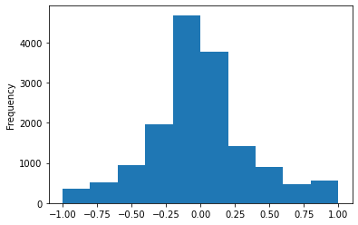
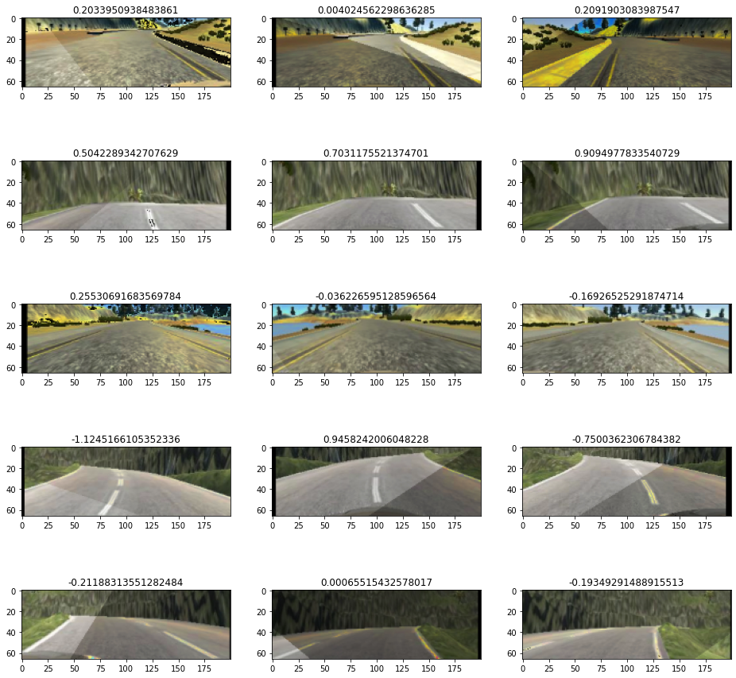
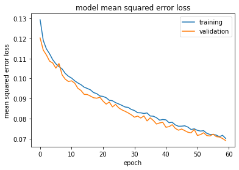

# Behavioral Cloning Project

#### 
#The goals / steps of this project are the following:

- Use the simulator to collect data of good driving behavior
- Build, a convolution neural network in Keras that predicts steering angles from images
- Train and validate the model with a training and validation set
- Test that the model successfully drives around track one without leaving the road
- Summarize the results with a written report


## Files Submitted & Code Quality
### 1. Submission includes all required files and can be used to run the simulator in autonomous mode

My project includes the following files:

* `model.py` containing the script to create the model
* `model_training.py` containing the script to train the model
* `drive.py` for driving the car in autonomous model
* `model.h5` containing a trained convolution neural network
* `video.mp4` python generated video of the simulator

### 2. Submission includes functional code

Using the Udacity provided simulator and my drive.py file, the car can be driven autonomously around the track by executing

   * python drive.py model.h5

### 3. Submission code is usable and readable

The model.py file contains the code for training and saving the convolution neural network. The file shows the pipeline I used for training and validating the model, and it contains comments to explain how the code works.


# Code examples and model explanations

first a code example of little helper functions and augmentation functions (explained later)


```python
import cv2
import numpy as np
import pandas as pd
from pathlib import Path
import matplotlib.pyplot as plt
import sklearn
import tensorflow as tf

###############################
## 01_Variables ###############
image_h = 66    # input height
image_w = 200  # input width
image_d = 3     # input depht = 3 channels

left_cf = 0.2 # correction factor for adjusting steering angle for left image 
right_cf = 0.2 # correction factor for adjusting steering angle for right image 


###############################
## 02_helpful_functions #######

def load_image(image_path):
    """
    in: path of the image
    out: image in RGB
    """
    path = Path(image_path)
    if path.is_file() and path.exists():
        image = cv2.cvtColor(cv2.imread(image_path), cv2.COLOR_BGR2RGB)
    else:
        image = None
    return image

def preprocess_image(img):
    """
    in: image
    out: preprocessed image
    function: 
        1: cropping image to reduce not needed information
        2: resizing image to target width/heith
        3: the nvidia article uses YUV bevause it separates the brigthness 
        information (y) which is less important, from the color information 
        (UV) which is more important
      
    """
    #img_shape = img.shape
    image = img[35:-25, :, :] #crop out top and bottom 20px
    image_resized = cv2.resize(image, (image_w, image_h), cv2.INTER_AREA)
    image_yuv = cv2.cvtColor(image_resized, cv2.COLOR_RGB2YUV)
    return image_yuv


def load_drivinglog(csv_path, columns_name=None):
    """
    in: path of the csv file, named columns
    out: df of csv driving_log
    """
    rel_path = Path(csv_path)  
    if rel_path.is_file() and rel_path.exists():
        if columns_name:
            df_driving_log = pd.read_csv(csv_path, header=None)
            df_driving_log = df_driving_log.rename(columns=columns_name)
        else:
            df_driving_log = pd.read_csv(csv_path)
            
    return df_driving_log 


def get_rel_path(image_path):
    """
    in: path from csv 
    out: relative path from working dic
    """
    image_path = image_path.replace("\\","/")
    rel_path = './' + image_path.split('/')[-3] + '/' + image_path.split('/')[-2] + '/' + image_path.split('/')[-1]
    return rel_path


###############################
## 03_augmentation #######
"""
The NN is only as good as the data we feed --> 
Enlarge the Dataset by using 5 augmentation techniques.
Augmentation helps to increase the amount of relevant data
"""
#from keras.preprocessing.image import ImageDataGenerator

def shift_augment(image, steering_angle, distance=0.1):
    """
    in: image, steering_angle, target distance to shift the image
    out: shifted image, new steering angle
    function: to learn how to follow the rod if the car position is not central,
    I add a random shift in x and y direction. Here for the cv2 function warpAffline is used.
    """
    h, w, d = image.shape
    shift_in_x =(np.random.rand()- 0.5) * distance
    shift_in_y =(np.random.rand()- 0.5) * distance
    shift = np.float32([[1, 0, shift_in_x], [0, 1, shift_in_y]])
    shift_image = cv2.warpAffine(image, shift, (w, h))
    new_steering_angle = steering_angle + shift_in_x * 0.002
    return shift_image, new_steering_angle

#def random_shadow(img):
def shadow_augment(image):
    """
    in: image
    out: new image with random added shadow area
    function: 
        1. random 2 points at height = 0 and max height
        2. create mask with two-point equation
        3. adding shadow by adjusting S-Channel of HLS colorspace
    code source: https://github.com/BerkeleyLearnVerify/VerifAI/blob/master/examples/data_augmentation/model/utils.py
    """
    h, w , d = image.shape
    x1, y1 = w * np.random.rand(), 0
    x2, y2 = w * np.random.rand(), h
    xm, ym = np.mgrid[0:h, 0:w]
    
    mask = np.zeros_like(image[:, :, 1])
    mask[(ym - y1) * (x2 - x1) - (y2 - y1) * (xm - x1) > 0] = 1

    cond = mask == np.random.randint(2)
    s_ratio = np.random.uniform(low=0.5, high=0.8)
     # adjust Saturation in HLS(Hue, Light, Saturation)
    hls = cv2.cvtColor(image, cv2.COLOR_RGB2HLS)
    hls[:, :, 1][cond] = hls[:, :, 1][cond] * s_ratio
    return cv2.cvtColor(hls, cv2.COLOR_HLS2RGB)

#def adjust_brightness(img):
def brightness_augment(img, factor=0.5):
    """
    adjusting brighness includes converting zu HSV and scaling the V channel
    """    
    hsv_img = cv2.cvtColor(img, cv2.COLOR_RGB2HSV) #convert to hsv
    hsv_img = np.array(hsv_img, dtype=np.float64)
    hsv_img[:, :, 2] = hsv_img[:, :, 2] * (factor + np.random.uniform()) #scale channel V uniformly
    hsv_img[:, :, 2][hsv_img[:, :, 2] > 255] = 255 #reset out of range values
    rgb_img = cv2.cvtColor(np.array(hsv_img, dtype=np.uint8), cv2.COLOR_HSV2RGB)
    return rgb_img 
    
    

#def flip(img, steering):
def flip_augment(img, steering_angle):
    """
    flipping randomloy with openCV
    flipcode > 0: flip horizontally --> that to use
    flipcode = 0: flip vertically
    flipcode < 0: flip vertically and horizontally
    """
    a = np.random.rand() # (0-1)
    if a < 0.5:
        img = cv2.flip(img, 1) #flip horizontally
        if(steering_angle != 0):
            steering_angle = -steering_angle #flip steering angle
    return img, steering_angle


def gaussian_blur(image):
    """
    The Gaussian filter is a low-pass filter so that the high-frequency components are reduced.
    could help by different resolution of the training data and road + environment structure
    """
    a = np.random.rand() # (0-1)
    if a < 0.5:
        image = cv2.GaussianBlur(image,(5,5),0)
    return image

```


```python

```

# Training data from simulator

The training data was chosen to keep the vehicle driving on the road. I was generating data at both tracks. I used per track...

- one round center lane driving and a second round recoverting from the left and right sides of the road. Here was only the recovering recorded.
- this time in opposite direction one round center lane driving and one round recovering  


```python
# load driving log (.csv) and add column names to driving log 
columns_name = {0: 'Center', 1: 'Left', 2: 'Right', 3: 'Steering Angle', 4: 'Throttle', 5:'Break', 6:'Speed'}
record_df = utilities.load_drivinglog('my_data/driving_log.csv', columns_name=columns_name)
record_df.head()
```


<div>
<style scoped>
    .dataframe tbody tr th:only-of-type {
        vertical-align: middle;
    }

    .dataframe tbody tr th {
        vertical-align: top;
    }

    .dataframe thead th {
        text-align: right;
    }
</style>
<table border="1" class="dataframe">
  <thead>
    <tr style="text-align: right;">
      <th></th>
      <th>Center Image</th>
      <th>Left Image</th>
      <th>Right Image</th>
      <th>Steering Angle</th>
      <th>Throttle</th>
      <th>Break</th>
      <th>Speed</th>
    </tr>
  </thead>
  <tbody>
    <tr>
      <th>0</th>
      <td>C:\Users\peter\Desktop\Udacity\Projects\18_Pro...</td>
      <td>C:\Users\peter\Desktop\Udacity\Projects\18_Pro...</td>
      <td>C:\Users\peter\Desktop\Udacity\Projects\18_Pro...</td>
      <td>0.0</td>
      <td>0.0</td>
      <td>0.0</td>
      <td>0.000033</td>
    </tr>
    <tr>
      <th>1</th>
      <td>C:\Users\peter\Desktop\Udacity\Projects\18_Pro...</td>
      <td>C:\Users\peter\Desktop\Udacity\Projects\18_Pro...</td>
      <td>C:\Users\peter\Desktop\Udacity\Projects\18_Pro...</td>
      <td>0.0</td>
      <td>0.0</td>
      <td>0.0</td>
      <td>0.000056</td>
    </tr>
    <tr>
      <th>2</th>
      <td>C:\Users\peter\Desktop\Udacity\Projects\18_Pro...</td>
      <td>C:\Users\peter\Desktop\Udacity\Projects\18_Pro...</td>
      <td>C:\Users\peter\Desktop\Udacity\Projects\18_Pro...</td>
      <td>0.0</td>
      <td>0.0</td>
      <td>0.0</td>
      <td>0.000006</td>
    </tr>
    <tr>
      <th>3</th>
      <td>C:\Users\peter\Desktop\Udacity\Projects\18_Pro...</td>
      <td>C:\Users\peter\Desktop\Udacity\Projects\18_Pro...</td>
      <td>C:\Users\peter\Desktop\Udacity\Projects\18_Pro...</td>
      <td>0.0</td>
      <td>0.0</td>
      <td>0.0</td>
      <td>0.000017</td>
    </tr>
    <tr>
      <th>4</th>
      <td>C:\Users\peter\Desktop\Udacity\Projects\18_Pro...</td>
      <td>C:\Users\peter\Desktop\Udacity\Projects\18_Pro...</td>
      <td>C:\Users\peter\Desktop\Udacity\Projects\18_Pro...</td>
      <td>0.0</td>
      <td>0.0</td>
      <td>0.0</td>
      <td>0.000108</td>
    </tr>
  </tbody>
</table>
</div>


```python
record_df.shape
```


    (15579, 7)


```python
plt.figure()
record_df['Steering Angle'].plot.hist()
```


    <AxesSubplot:ylabel='Frequency'>


    

    


The histogramm of the steering angles shows that there seems to be a good balance between left and right steering angles. A little bit the histogramm is shifted to negative values, but this should not be a problem, since we will adding data augmentation later on.


# Better performance with data augmentation

The NN is only as good as the data we feed. Augmentation has the befits:
- we can easily enlarge the dataset 
- we can increase the amount of relevant data
- we can help find the nn the parts of the image that really matter for the task 

So we use randomly 5 augmentation techniques:
* flip some images horizontally to keep balance of left turn and right turn 
* adjusting brighness (includes converting zu HSV and scaling the V channel)
* shifting the image horizontal and vertical and adjusting the steering angle accordingly. 
* adding to the image some area with shadow 
* adding the Gaussian filter for noise reduction (could help by different resolution of the training data and road + environment structure=

The images from each of the left, center and right camera are used. Because the steering angle only for the center camera is given, the steering angle for the left and right camera is calculated by adding/substratring an adjustment. 


```python
def pipeline_augment(image, steering_angle):
    # random flip horizontally
    image_aug, steering = utilities.flip_augment(image, steering_angle)
    # random shift in x and y direction. shift distance variable = distance
    image_aug, steering = utilities.shift_augment(image, steering_angle, distance=20)
    # random added shadows (by masking and adjusting saturation)
    image_aug = utilities.shadow_augment(image)
    # random added brightness
    image_aug = utilities.brightness_augment(image)
    # noise reduction by gaussian blur 
    image_aug = utilities.gaussian_blur(image)
    return image_aug, steering_angle
```

# Preparation of the images

1.0. load images based on the paths in the data frame batch file

2.0. adjust steering angle for right or left shifted/recorded images

3.0. do image augmentation and preprocessing for the nn model
        
3.1. cropping image to reduce not needed information

3.2. resizing image to target width/heith

3.3. the nvidia article uses YUV bevause it separates the brigthness information (y) which is less important, from the color information (UV) which is more important


```python
# pipeline for loading training/validation data and adding augmentation and preprocessing
def load_training_data(batch):
    """
    in: data frame batch with {0: 'Center', 1: 'Left', 2: 'Right', 3: 'Steering Angle'}
    out: for this batch a list of all images (training data) and steering angles (labels)
    function: 
        1. load images based on the paths in the data frame batch file
        2. adjust steering angle for right or left shifted/recorded images
        3. do image augmentation and preprocessing for the nn model
        4. output all images and steering angles in 2 lists
    """
    
    left_cf = utilities.left_cf     # correction factor for steering angle for left image 
    right_cf = utilities.right_cf   # correction factor for steering angle for right image 
    list_images = []            # empty list for output
    list_steering_angle = []    # empty list for output
    
    for index, row in batch.iterrows():
        # load path for images
        path_left = utilities.get_rel_path(row['Left'])
        path_right = utilities.get_rel_path(row['Right'])
        path_center = utilities.get_rel_path(row['Center'])
        center_angle = float(row['Steering Angle'])
        # load Images
        left_img = utilities.load_image(path_left)
        center_img = utilities.load_image(path_right)
        right_img = utilities.load_image(path_center)
        # For the shifted richt and left images: adjust the steering angle
        lenft_angle = center_angle + left_cf
        right_angle = center_angle - right_cf
        # Augment the Image
        left_img_aug, lenft_angle = pipeline_augment(left_img, lenft_angle)
        center_img_aug, center_angle = pipeline_augment(center_img, center_angle)
        right_img_aug, right_angle = pipeline_augment(right_img, right_angle)
        # Preprocess (Cropping, resizing, transformation in YUV-Colorspace) the augmented images
        left_img_aug_prepro = utilities.preprocess_image(left_img_aug)
        center_img_aug_prepro = utilities.preprocess_image(center_img_aug)
        right_img_aug_prepro = utilities.preprocess_image(right_img_aug)
        # append Images and steering angles to lists for output
        list_images.append(left_img_aug_prepro)
        list_steering_angle.append(lenft_angle)
        list_images.append(center_img_aug_prepro)
        list_steering_angle.append(center_angle)
        list_images.append(right_img_aug_prepro)
        list_steering_angle.append(right_angle)
        
    return list_images, list_steering_angle

```

#### Building a generator for hand over training data and labels in small batches --> avoiding "out of memory" errors


```python
def batch_generator(data, batchsize=batchsize):
    """
    in: data frame with {0: 'Center', 1: 'Left', 2: 'Right', 3: 'Steering Angle'}
    out: training data (images = X_train) and training labels (steering angles = y_train)
    function: as a generator it returns/yieds the next augmented and preprocessed batch of training/validation data
        1. shuffle the data
        2. load the augmented and preprocessed batch
        3. return it to the model, then yield
    """
    data_length = len(data) # data type = data frame
    while 1:
        sklearn.utils.shuffle(data)
        for count in range(0, data_length, batchsize):
            batch = data[count:count+batchsize]
            images, steering_angles = load_training_data(batch)
            X_train = np.array(images)
            y_train = np.array(steering_angles)
            sklearn.utils.shuffle(X_train, y_train)
            yield X_train, y_train
```

#### splitting the data in training and validation data, using the train_test_split function from sklearn.model_selection


```python
train_samples, valid_samples = train_test_split(record_df, test_size=0.2)
```

#### create the generators for training and validation  


```python
train_generator = batch_generator(train_samples)
valid_generator = batch_generator(valid_samples)
```


```python
train_samples[0:3]
```


<div>
<style scoped>
    .dataframe tbody tr th:only-of-type {
        vertical-align: middle;
    }

    .dataframe tbody tr th {
        vertical-align: top;
    }

    .dataframe thead th {
        text-align: right;
    }
</style>
<table border="1" class="dataframe">
  <thead>
    <tr style="text-align: right;">
      <th></th>
      <th>Center Image</th>
      <th>Left Image</th>
      <th>Right Image</th>
      <th>Steering Angle</th>
      <th>Throttle</th>
      <th>Break</th>
      <th>Speed</th>
    </tr>
  </thead>
  <tbody>
    <tr>
      <th>11375</th>
      <td>C:\Users\peter\Desktop\Udacity\Projects\18_Pro...</td>
      <td>C:\Users\peter\Desktop\Udacity\Projects\18_Pro...</td>
      <td>C:\Users\peter\Desktop\Udacity\Projects\18_Pro...</td>
      <td>-0.009434</td>
      <td>0.00000</td>
      <td>0.0</td>
      <td>18.29334</td>
    </tr>
    <tr>
      <th>13921</th>
      <td>C:\Users\peter\Desktop\Udacity\Projects\18_Pro...</td>
      <td>C:\Users\peter\Desktop\Udacity\Projects\18_Pro...</td>
      <td>C:\Users\peter\Desktop\Udacity\Projects\18_Pro...</td>
      <td>-0.716981</td>
      <td>0.00000</td>
      <td>0.0</td>
      <td>13.09298</td>
    </tr>
    <tr>
      <th>9560</th>
      <td>C:\Users\peter\Desktop\Udacity\Projects\18_Pro...</td>
      <td>C:\Users\peter\Desktop\Udacity\Projects\18_Pro...</td>
      <td>C:\Users\peter\Desktop\Udacity\Projects\18_Pro...</td>
      <td>0.037736</td>
      <td>0.24457</td>
      <td>0.0</td>
      <td>27.54350</td>
    </tr>
  </tbody>
</table>
</div>


# Example of preprocessed training data and steering angles


```python
examples = []
for batch in train_generator:
    examples = batch
    break
plot_images(examples[0][:15], examples[1][:15])
```


    

    


As can be seen above the augmentation and preprocessing worked

# Model

The overall strategy was to research what is the state of the art approach for this kind of task. In the paper "End to End Learning to Self-Driving Cars" from Mariusz Bojarski et al. from NVIDIA Corporation 2016-04-25 (https://developer.nvidia.com/blog/deep-learning-self-driving-cars/) I found a well working approach. 


My first step was to use rebuild the convolution neural network M. Bojarski et al. used.

#### Used Architecure from M. Bojarski et al. "End to End Learing to Self-Driving Cars"


#### Model Architecture based on M. Bojarski et al.

---

 Layer            | Feature     |Kernel Size| Strides | Activation | Padding| Type |
------------------|-------------|-----------|---------|------------|--------|------|
**Input**         |(66,200,3)   |           |         |            |        |Input
**Normalization** |Lambda       |           |         |            |        |Preprocess
**Cropping2D**    |[35:-25,:,:] |           |         |            |        |Preprocess
**Convolution2D** |Filter: 24   |    5x5    |   2x2   |   elu      |   Same |Convolutional
**Convolution2D** |Filter: 36   |    5x5    |   2x2   |   elu      |   Same |Convolutional
**Convolution2D** |Filter: 48   |    5x5    |   2x2   |   elu      |   Same |Convolutional
**Convolution2D** |Filter: 64   |    3x3    |   1x1   |   elu      |   Same |Convolutional
**Convolution2D** |Filter: 64   |    3x3    |   1x1   |   elu      |   Same |Convolutional
**Flatten**       |             |           |         |            |        |
**Dropout**       |0.5          |           |         |            |        |
**Dense**         |Neurons: 100 |           |         |   elu      |        |Fully Connected
**Dense**         |Neurons: 50  |           |         |   relu     |        |Fully Connected
**Dense**         |Neurons: 10  |           |         |   relu     |        |Fully Connected
**Dense**         |Neurons: 1   |           |         |            |        |Output


The network consists of 9 layers:1 normalization, 5 convolutional layers and 3 fully connected layers. The first layer gets a resized image in 66x200x3 (NVIDIA Design) and normalizes it. I used the exponential linear unit (ELU) activation instead of a simple rectified linear unit (ReLU), because the area of nonlinearity is higher and I get better results. For the last 2 layers  I use ReLus. Dropout is implemented once after flattening the convolutional layers for avoiding overfitting.


```python
import tensorflow.contrib.keras as keras
from keras.models import Sequential
from keras.layers import Lambda, Conv2D, Flatten, Dense, Activation, Cropping2D, Dropout
import utilities

def nvidia_model(optimizer, loss='mse'):
    """
    Rebuild of the convolution neural network from M. Bojarski et al. from NVIDIA 2016-04-25
    
    The network consists of 9 layers:1 normalization, 5 convolutional layers and 3 fully connected layers.
    I used the exponential linear unit (ELU) activation instead of a simple rectified linear unit (ReLU), 
    because the area of nonlinearity is higher and I get better results. For the last 2 I use ReLus.
    """
    model = Sequential()

    #model.add(Lambda(lambda x: x /127.5 - 1.0, input_shape = (utilities.image_h, utilities.image_w, utilities.image_d)))
    model.add(Lambda(lambda x: x /255 - 0.5, input_shape = (utilities.image_h, utilities.image_w, utilities.image_d)))
   
    #5 convolutional layers
    # strided convolutions in the first 3 Conv-layers with a 2x2 stride and a 5x5 kernel
    model.add(Conv2D(24, (5, 5), activation="elu", strides=(2, 2)))
    model.add(Conv2D(36, (5, 5), activation="elu", strides=(2, 2)))
    model.add(Conv2D(48, (5, 5), activation="elu", strides=(2, 2)))
    # non strided convolutions in the last 2 Conv-layers with a 2x2 stride and a 3x3 kernel
    model.add(Conv2D(64, (3, 3), activation="elu", strides=(1, 1)))
    model.add(Conv2D(64, (3, 3), activation="elu", strides=(1, 1)))

    model.add(Flatten())
    #Dropout to reduce overfitting
    model.add(Dropout(0.5))
    
    # 3 fully connected layer
    model.add(Dense(100))
    model.add(Activation('elu'))
    model.add(Dense(50))
    model.add(Activation('relu'))
    model.add(Dense(10))
    model.add(Activation('relu'))
    model.add(Dense(1))

    model.compile(loss=loss, optimizer=optimizer)

    return model
```

### The model uses an adam optimizer:
-  adaptive approach to apply a variable learning rate; 
- benefits of computational efficiency and minimal memory requirements.

The model uses 60 epochs with callback early stopping (patience =6)


```python
optimizer=Adam(1e-4, decay=0.0)
epochs = 60
```


```python
# loading model
nvidia_model = model.nvidia_model(optimizer)
```


```python
# adding callbacks: early stopping and saving of best fitted model per epoch
callback_es = EarlyStopping(monitor='val_loss', mode='auto', verbose=1, patience=6)
callback_cp = ModelCheckpoint('model_best_fit.h5', monitor='val_loss', verbose=1, save_best_only=True, mode='auto')

```


```python
# start training of the model
net_history = nvidia_model.fit_generator(train_generator, 
                    steps_per_epoch= ceil(len(train_samples)/batchsize),
                    validation_data=valid_generator, 
                    validation_steps= ceil(len(valid_samples)/batchsize),
                    epochs=epochs, callbacks=[callback_es, callback_cp])

```

    C:\Users\peter\Anaconda3\lib\site-packages\tensorflow\python\keras\engine\training.py:1844: UserWarning: `Model.fit_generator` is deprecated and will be removed in a future version. Please use `Model.fit`, which supports generators.
      warnings.warn('`Model.fit_generator` is deprecated and '
    C:\Users\peter\Anaconda3\lib\site-packages\tensorflow\python\data\ops\dataset_ops.py:3504: UserWarning: Even though the tf.config.experimental_run_functions_eagerly option is set, this option does not apply to tf.data functions. tf.data functions are still traced and executed as graphs.
      "Even though the tf.config.experimental_run_functions_eagerly "
    

    Epoch 1/60
    390/390 [==============================] - 469s 1s/step - loss: 0.1390 - val_loss: 0.1202
    
    Epoch 00001: val_loss improved from inf to 0.12025, saving model to model_best_fit.h5
    Epoch 2/60
    390/390 [==============================] - 270s 693ms/step - loss: 0.1223 - val_loss: 0.1142
    
    Epoch 00002: val_loss improved from 0.12025 to 0.11421, saving model to model_best_fit.h5
    Epoch 3/60
    390/390 [==============================] - 276s 707ms/step - loss: 0.1165 - val_loss: 0.1118
    
    Epoch 00003: val_loss improved from 0.11421 to 0.11177, saving model to model_best_fit.h5
    Epoch 4/60
    390/390 [==============================] - 264s 677ms/step - loss: 0.1151 - val_loss: 0.1087
    
    Epoch 00004: val_loss improved from 0.11177 to 0.10870, saving model to model_best_fit.h5
    Epoch 5/60
    390/390 [==============================] - 262s 672ms/step - loss: 0.1113 - val_loss: 0.1078
    
    Epoch 00005: val_loss improved from 0.10870 to 0.10777, saving model to model_best_fit.h5
    Epoch 6/60
    390/390 [==============================] - 261s 670ms/step - loss: 0.1078 - val_loss: 0.1052
    
    Epoch 00006: val_loss improved from 0.10777 to 0.10520, saving model to model_best_fit.h5
    Epoch 7/60
    390/390 [==============================] - 261s 670ms/step - loss: 0.1080 - val_loss: 0.1075
    
    Epoch 00007: val_loss did not improve from 0.10520
    Epoch 8/60
    390/390 [==============================] - 274s 702ms/step - loss: 0.1063 - val_loss: 0.1018
    
    Epoch 00008: val_loss improved from 0.10520 to 0.10182, saving model to model_best_fit.h5
    Epoch 9/60
    390/390 [==============================] - 267s 686ms/step - loss: 0.1039 - val_loss: 0.0997
    
    Epoch 00009: val_loss improved from 0.10182 to 0.09967, saving model to model_best_fit.h5
    Epoch 10/60
    390/390 [==============================] - 271s 696ms/step - loss: 0.1020 - val_loss: 0.0985
    
    Epoch 00010: val_loss improved from 0.09967 to 0.09852, saving model to model_best_fit.h5
    Epoch 11/60
    390/390 [==============================] - 280s 719ms/step - loss: 0.1016 - val_loss: 0.0989
    
    Epoch 00011: val_loss did not improve from 0.09852
    Epoch 12/60
    390/390 [==============================] - 279s 717ms/step - loss: 0.1002 - val_loss: 0.0977
    
    Epoch 00012: val_loss improved from 0.09852 to 0.09771, saving model to model_best_fit.h5
    Epoch 13/60
    390/390 [==============================] - 274s 704ms/step - loss: 0.0991 - val_loss: 0.0951
    
    Epoch 00013: val_loss improved from 0.09771 to 0.09514, saving model to model_best_fit.h5
    Epoch 14/60
    390/390 [==============================] - 282s 724ms/step - loss: 0.0973 - val_loss: 0.0940
    
    Epoch 00014: val_loss improved from 0.09514 to 0.09404, saving model to model_best_fit.h5
    Epoch 15/60
    390/390 [==============================] - 279s 717ms/step - loss: 0.0972 - val_loss: 0.0921
    
    Epoch 00015: val_loss improved from 0.09404 to 0.09211, saving model to model_best_fit.h5
    Epoch 16/60
    390/390 [==============================] - 273s 700ms/step - loss: 0.0958 - val_loss: 0.0920
    
    Epoch 00016: val_loss improved from 0.09211 to 0.09203, saving model to model_best_fit.h5
    Epoch 17/60
    390/390 [==============================] - 274s 704ms/step - loss: 0.0956 - val_loss: 0.0912
    
    Epoch 00017: val_loss improved from 0.09203 to 0.09125, saving model to model_best_fit.h5
    Epoch 18/60
    390/390 [==============================] - 275s 706ms/step - loss: 0.0944 - val_loss: 0.0904
    
    Epoch 00018: val_loss improved from 0.09125 to 0.09041, saving model to model_best_fit.h5
    Epoch 19/60
    390/390 [==============================] - 273s 701ms/step - loss: 0.0938 - val_loss: 0.0902
    
    Epoch 00019: val_loss improved from 0.09041 to 0.09019, saving model to model_best_fit.h5
    Epoch 20/60
    390/390 [==============================] - 274s 702ms/step - loss: 0.0921 - val_loss: 0.0907
    
    Epoch 00020: val_loss did not improve from 0.09019
    Epoch 21/60
    390/390 [==============================] - 272s 697ms/step - loss: 0.0920 - val_loss: 0.0888
    
    Epoch 00021: val_loss improved from 0.09019 to 0.08876, saving model to model_best_fit.h5
    Epoch 22/60
    390/390 [==============================] - 272s 698ms/step - loss: 0.0919 - val_loss: 0.0872
    
    Epoch 00022: val_loss improved from 0.08876 to 0.08724, saving model to model_best_fit.h5
    Epoch 23/60
    390/390 [==============================] - 274s 702ms/step - loss: 0.0903 - val_loss: 0.0883
    
    Epoch 00023: val_loss did not improve from 0.08724
    Epoch 24/60
    390/390 [==============================] - 275s 705ms/step - loss: 0.0898 - val_loss: 0.0859
    
    Epoch 00024: val_loss improved from 0.08724 to 0.08586, saving model to model_best_fit.h5
    Epoch 25/60
    390/390 [==============================] - 274s 703ms/step - loss: 0.0891 - val_loss: 0.0871
    
    Epoch 00025: val_loss did not improve from 0.08586
    Epoch 26/60
    390/390 [==============================] - 275s 705ms/step - loss: 0.0889 - val_loss: 0.0854
    
    Epoch 00026: val_loss improved from 0.08586 to 0.08536, saving model to model_best_fit.h5
    Epoch 27/60
    390/390 [==============================] - 274s 702ms/step - loss: 0.0876 - val_loss: 0.0844
    
    Epoch 00027: val_loss improved from 0.08536 to 0.08438, saving model to model_best_fit.h5
    Epoch 28/60
    390/390 [==============================] - 274s 702ms/step - loss: 0.0866 - val_loss: 0.0837
    
    Epoch 00028: val_loss improved from 0.08438 to 0.08366, saving model to model_best_fit.h5
    Epoch 29/60
    390/390 [==============================] - 272s 699ms/step - loss: 0.0863 - val_loss: 0.0828
    
    Epoch 00029: val_loss improved from 0.08366 to 0.08285, saving model to model_best_fit.h5
    Epoch 30/60
    390/390 [==============================] - 273s 702ms/step - loss: 0.0853 - val_loss: 0.0819
    
    Epoch 00030: val_loss improved from 0.08285 to 0.08190, saving model to model_best_fit.h5
    Epoch 31/60
    390/390 [==============================] - 273s 700ms/step - loss: 0.0848 - val_loss: 0.0807
    
    Epoch 00031: val_loss improved from 0.08190 to 0.08072, saving model to model_best_fit.h5
    Epoch 32/60
    390/390 [==============================] - 297s 761ms/step - loss: 0.0837 - val_loss: 0.0813
    
    Epoch 00032: val_loss did not improve from 0.08072
    Epoch 33/60
    390/390 [==============================] - 277s 711ms/step - loss: 0.0833 - val_loss: 0.0803
    
    Epoch 00033: val_loss improved from 0.08072 to 0.08029, saving model to model_best_fit.h5
    Epoch 34/60
    390/390 [==============================] - 278s 714ms/step - loss: 0.0834 - val_loss: 0.0813
    
    Epoch 00034: val_loss did not improve from 0.08029
    Epoch 35/60
    390/390 [==============================] - 273s 701ms/step - loss: 0.0834 - val_loss: 0.0788
    
    Epoch 00035: val_loss improved from 0.08029 to 0.07885, saving model to model_best_fit.h5
    Epoch 36/60
    390/390 [==============================] - 280s 719ms/step - loss: 0.0827 - val_loss: 0.0804
    
    Epoch 00036: val_loss did not improve from 0.07885
    Epoch 37/60
    390/390 [==============================] - 299s 769ms/step - loss: 0.0824 - val_loss: 0.0791
    
    Epoch 00037: val_loss did not improve from 0.07885
    Epoch 38/60
    390/390 [==============================] - 333s 856ms/step - loss: 0.0811 - val_loss: 0.0773
    
    Epoch 00038: val_loss improved from 0.07885 to 0.07730, saving model to model_best_fit.h5
    Epoch 39/60
    390/390 [==============================] - 373s 958ms/step - loss: 0.0804 - val_loss: 0.0779
    
    Epoch 00039: val_loss did not improve from 0.07730
    Epoch 40/60
    390/390 [==============================] - 333s 855ms/step - loss: 0.0808 - val_loss: 0.0781
    
    Epoch 00040: val_loss did not improve from 0.07730
    Epoch 41/60
    390/390 [==============================] - 306s 785ms/step - loss: 0.0804 - val_loss: 0.0757
    
    Epoch 00041: val_loss improved from 0.07730 to 0.07569, saving model to model_best_fit.h5
    Epoch 42/60
    390/390 [==============================] - 346s 888ms/step - loss: 0.0782 - val_loss: 0.0760
    
    Epoch 00042: val_loss did not improve from 0.07569
    Epoch 43/60
    390/390 [==============================] - 409s 1s/step - loss: 0.0787 - val_loss: 0.0770
    
    Epoch 00043: val_loss did not improve from 0.07569
    Epoch 44/60
    390/390 [==============================] - 385s 988ms/step - loss: 0.0771 - val_loss: 0.0751
    
    Epoch 00044: val_loss improved from 0.07569 to 0.07511, saving model to model_best_fit.h5
    Epoch 45/60
    390/390 [==============================] - 305s 784ms/step - loss: 0.0766 - val_loss: 0.0742
    
    Epoch 00045: val_loss improved from 0.07511 to 0.07421, saving model to model_best_fit.h5
    Epoch 46/60
    390/390 [==============================] - 273s 701ms/step - loss: 0.0769 - val_loss: 0.0748
    
    Epoch 00046: val_loss did not improve from 0.07421
    Epoch 47/60
    390/390 [==============================] - 267s 686ms/step - loss: 0.0776 - val_loss: 0.0740
    
    Epoch 00047: val_loss improved from 0.07421 to 0.07399, saving model to model_best_fit.h5
    Epoch 48/60
    390/390 [==============================] - 264s 678ms/step - loss: 0.0757 - val_loss: 0.0732
    
    Epoch 00048: val_loss improved from 0.07399 to 0.07320, saving model to model_best_fit.h5
    Epoch 49/60
    390/390 [==============================] - 262s 674ms/step - loss: 0.0748 - val_loss: 0.0729
    
    Epoch 00049: val_loss improved from 0.07320 to 0.07289, saving model to model_best_fit.h5
    Epoch 50/60
    390/390 [==============================] - 274s 703ms/step - loss: 0.0755 - val_loss: 0.0746
    
    Epoch 00050: val_loss did not improve from 0.07289
    Epoch 51/60
    390/390 [==============================] - 269s 691ms/step - loss: 0.0753 - val_loss: 0.0716
    
    Epoch 00051: val_loss improved from 0.07289 to 0.07160, saving model to model_best_fit.h5
    Epoch 52/60
    390/390 [==============================] - 268s 688ms/step - loss: 0.0740 - val_loss: 0.0720
    
    Epoch 00052: val_loss did not improve from 0.07160
    Epoch 53/60
    390/390 [==============================] - 269s 689ms/step - loss: 0.0744 - val_loss: 0.0730
    
    Epoch 00053: val_loss did not improve from 0.07160
    Epoch 54/60
    390/390 [==============================] - 268s 687ms/step - loss: 0.0735 - val_loss: 0.0715
    
    Epoch 00054: val_loss improved from 0.07160 to 0.07155, saving model to model_best_fit.h5
    Epoch 55/60
    390/390 [==============================] - 278s 714ms/step - loss: 0.0726 - val_loss: 0.0713
    
    Epoch 00055: val_loss improved from 0.07155 to 0.07133, saving model to model_best_fit.h5
    Epoch 56/60
    390/390 [==============================] - 270s 692ms/step - loss: 0.0726 - val_loss: 0.0723
    
    Epoch 00056: val_loss did not improve from 0.07133
    Epoch 57/60
    390/390 [==============================] - 279s 716ms/step - loss: 0.0723 - val_loss: 0.0710
    
    Epoch 00057: val_loss improved from 0.07133 to 0.07102, saving model to model_best_fit.h5
    Epoch 58/60
    390/390 [==============================] - 273s 701ms/step - loss: 0.0712 - val_loss: 0.0708
    
    Epoch 00058: val_loss improved from 0.07102 to 0.07081, saving model to model_best_fit.h5
    Epoch 59/60
    390/390 [==============================] - 276s 707ms/step - loss: 0.0722 - val_loss: 0.0701
    
    Epoch 00059: val_loss improved from 0.07081 to 0.07007, saving model to model_best_fit.h5
    Epoch 60/60
    390/390 [==============================] - 268s 688ms/step - loss: 0.0709 - val_loss: 0.0690
    
    Epoch 00060: val_loss improved from 0.07007 to 0.06903, saving model to model_best_fit.h5
    


```python
plt.plot(history.history['loss'])
plt.plot(history.history['val_loss'])
plt.title('model mean squared error loss')
plt.ylabel('mean squared error loss')
plt.xlabel('epoch')
plt.legend(['training', 'validation'], loc='upper right')
plt.show()
```


    

    


Above you can see my first run results. It was without ELU/ReLU activation functions at the fully connected layers. The validation loss after 60 epochs of training was 0.0707. 

By adding ELU/ReLU activation functions at the fully connected layers I was able to get an validation loss of 0.049.


```python
# Import everything needed to edit/save/watch video clipsfrom IPython.display import HTML

```


```python
HTML("""
    <video alt="test" controls>
        <source src="run_track1.mp4" type="video/mp4">
    </video>
""")
```


<video alt="test" controls>
    <source src="run_track1.mp4" type="video/mp4">
</video>


## Evaluation
The NVIDIA deep learning CNN worked very good on the collected data. The track 1 was driven very well from the trained CNN. 
I'm sure it would also work for track 2. But in fact my local machine was broken while this project and I had a little trouble generating and uploading data for track 2 to the udacity workspace. And so the CNN wasn't having enough data fo this track. Or maybe the data I provided was too poor driven. So I skip the track 2 until I get my local machine back. 


```python

```
